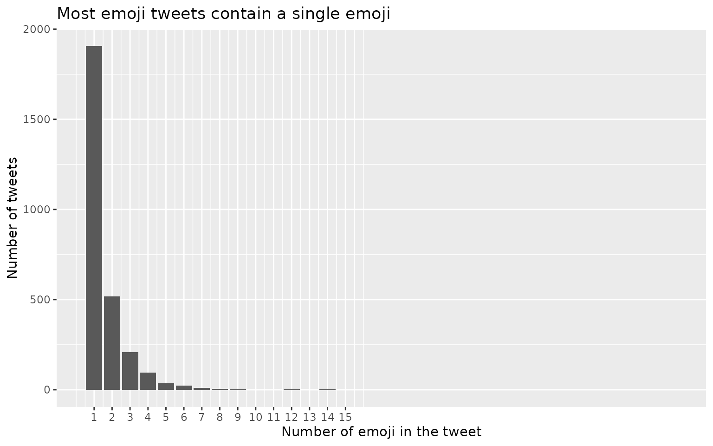
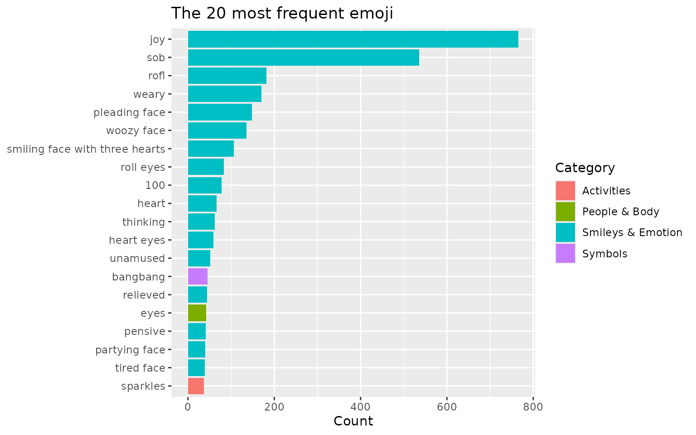
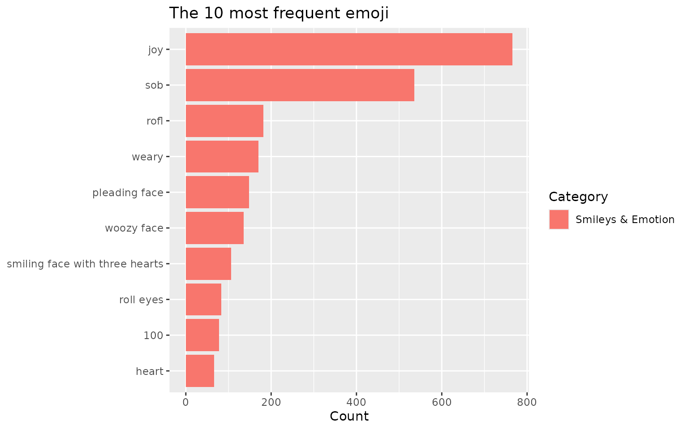
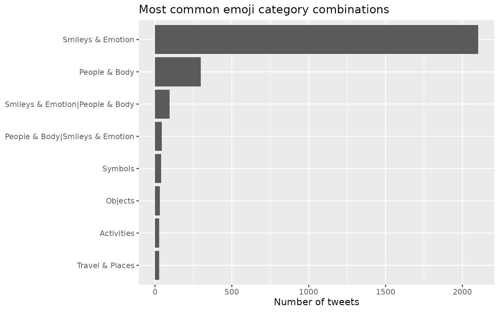
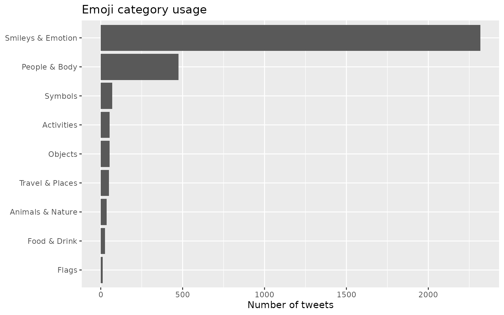
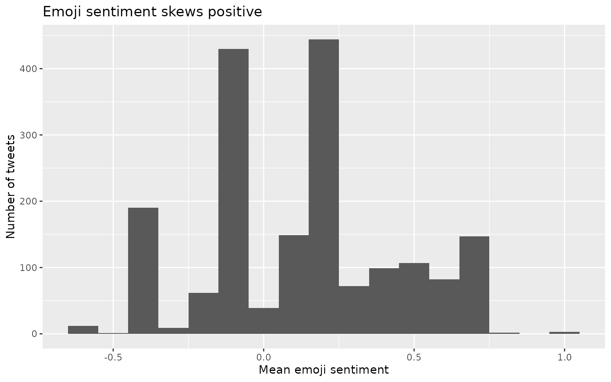
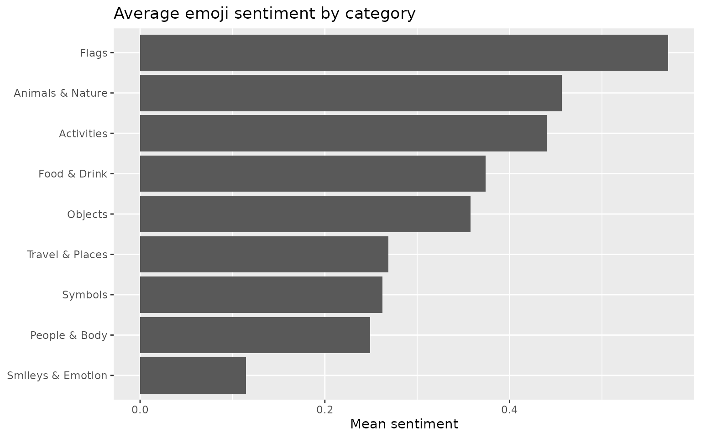

# Introduction to tidyEmoji

## Overview

Emoji are everywhere in modern text — social-media posts, product
reviews, chat and support logs, survey free-text — and they carry
information that plain words do not. Yet summarising emoji from a corpus
is surprisingly awkward. Unicode does not interact cleanly with regular
expressions, not every code point is an emoji, and a single visible
emoji is often built from several code points joined together. Counting
“how many posts contain an emoji” or “which emoji are most common” by
hand quickly becomes painful.

**tidyEmoji** removes that friction. It provides a small family of verbs
that take a data frame and the name of a text column, and return tidy
data frames that drop straight into a `dplyr`/`ggplot2` workflow:

| Task | Function(s) |
|----|----|
| Summarise / filter | [`emoji_summary()`](https://pursuitofdatascience.github.io/tidyEmoji/reference/emoji_summary.md), [`emoji_filter()`](https://pursuitofdatascience.github.io/tidyEmoji/reference/emoji_filter.md) |
| Extract | [`emoji_extract_nest()`](https://pursuitofdatascience.github.io/tidyEmoji/reference/emoji_extract_nest.md), [`emoji_extract_unnest()`](https://pursuitofdatascience.github.io/tidyEmoji/reference/emoji_extract_unnest.md), [`emoji_tokens()`](https://pursuitofdatascience.github.io/tidyEmoji/reference/emoji_tokens.md) |
| Count | [`emoji_frequency()`](https://pursuitofdatascience.github.io/tidyEmoji/reference/emoji_frequency.md), [`top_n_emojis()`](https://pursuitofdatascience.github.io/tidyEmoji/reference/top_n_emojis.md) |
| Categorise | [`emoji_categorize()`](https://pursuitofdatascience.github.io/tidyEmoji/reference/emoji_categorize.md) |
| Score sentiment | [`emoji_sentiment()`](https://pursuitofdatascience.github.io/tidyEmoji/reference/emoji_sentiment.md) |

Two design choices are worth highlighting:

- **Grapheme-aware detection.** Detection is performed on whole grapheme
  clusters, so skin-tone modifiers (👍🏽) and zero-width-joiner sequences
  such as the family emoji (👨‍👩‍👧‍👦) are treated as a *single* emoji rather
  than being split into their component parts. This is illustrated in
  the [extraction section](#a-note-on-grapheme-aware-detection).
- **Tidy by default.** Every verb returns a tibble, follows the
  `verb(data, text_column)` convention, and supports unquoted column
  names, so the functions compose naturally with the pipe.

``` r

library(tidyEmoji)
library(dplyr)
library(ggplot2)
```

## Example data

Throughout this vignette we use a sample of 10,000 tweets collected in
Atlanta, Georgia. Tweets are a convenient, emoji-rich example, but
nothing below is specific to Twitter — any data frame with a text column
will do.

``` r

ata_tweets <- readr::read_csv("ata_tweets.rda", show_col_types = FALSE)
ata_tweets
#> # A tibble: 10,000 × 1
#>    full_text                                                                    
#>    <chr>                                                                        
#>  1 "im not arguing  im not fighting nobody w a gun. people are dying every day …
#>  2 "Time left until rump leaves office\nZoom\n56days\n1349hours\n80940minutes\n…
#>  3 "It’s been 15 years since my father’s imprisonment  I swore it would get eas…
#>  4 "Friendsgiving with my roomies🥰"                                            
#>  5 "Going to be one of those “countdown app” people just so I have motivation t…
#>  6 "When I can turn my philosophical thoughts into poetry. The world gone be on…
#>  7 "These females really be trying it but fail to realize my girl tells me ever…
#>  8 "why my sister called me toxic lmao"                                         
#>  9 "What a great year to be not taking care of no kids."                        
#> 10 "definitely don’t see any children in my near future, not with me trying to …
#> # ℹ 9,990 more rows
```

The actual text lives in the `full_text` column, which is the column we
pass to each tidyEmoji verb.

## Detecting and summarising emoji

### `emoji_summary()`

[`emoji_summary()`](https://pursuitofdatascience.github.io/tidyEmoji/reference/emoji_summary.md)
answers the first question one usually asks of a new corpus: *how much
emoji is in here?* It returns a one-row tibble with the number of
entries that contain at least one emoji and the total number of entries.
An entry is counted once regardless of how many emoji it holds.

``` r

summary_tbl <- ata_tweets %>%
  emoji_summary(full_text)

summary_tbl
#> # A tibble: 1 × 2
#>   emoji_tweets total_tweets
#>          <int>        <int>
#> 1         2818        10000
```

Here, 2,818 of the 10,000 tweets (28.2%) contain at least one emoji.

### `emoji_filter()`

[`emoji_filter()`](https://pursuitofdatascience.github.io/tidyEmoji/reference/emoji_filter.md)
keeps only the rows whose text contains at least one emoji, preserving
every original column. This is useful when you want to compare
emoji-bearing and emoji-free text, or restrict an analysis to the emoji
subset.
([`emoji_tweets()`](https://pursuitofdatascience.github.io/tidyEmoji/reference/emoji_filter.md)
is a synonym retained for backward compatibility.)

``` r

ata_tweets %>%
  emoji_filter(full_text)
#> # A tibble: 2,818 × 1
#>    full_text                                                                    
#>    <chr>                                                                        
#>  1 It’s been 15 years since my father’s imprisonment  I swore it would get easi…
#>  2 Friendsgiving with my roomies🥰                                              
#>  3 When I can turn my philosophical thoughts into poetry. The world gone be on …
#>  4 I always get the last laugh 🥰 so I let people do what they want             
#>  5 One thing about me, imma keep that same energy. 🙃                           
#>  6 I’m really dope. 😎                                                          
#>  7 I miss my bb🥺                                                               
#>  8 Got half of bae and raidens Christmas shopping done 😩🙌🏽🙌🏽                   
#>  9 Y’all be letting anybody in the studio and ion like dat🥴                    
#> 10 Sometimes I need to work on myself before I can please anyone or get ready f…
#> # ℹ 2,808 more rows
```

## Extracting emoji

tidyEmoji offers three complementary ways to pull the emoji out of text,
depending on the shape of output you want.

### `emoji_extract_nest()`

[`emoji_extract_nest()`](https://pursuitofdatascience.github.io/tidyEmoji/reference/emoji_extract_nest.md)
leaves the data unchanged except for an added list-column,
`.emoji_unicode`, holding the emoji found in each row. The original data
structure is preserved, which makes this convenient as an intermediate
step.

``` r

ata_tweets %>%
  emoji_extract_nest(full_text) %>%
  select(full_text, .emoji_unicode)
#> # A tibble: 10,000 × 2
#>    full_text                                                      .emoji_unicode
#>    <chr>                                                          <list>        
#>  1 "im not arguing  im not fighting nobody w a gun. people are d… <chr [0]>     
#>  2 "Time left until rump leaves office\nZoom\n56days\n1349hours\… <chr [0]>     
#>  3 "It’s been 15 years since my father’s imprisonment  I swore i… <chr [1]>     
#>  4 "Friendsgiving with my roomies🥰"                              <chr [1]>     
#>  5 "Going to be one of those “countdown app” people just so I ha… <chr [0]>     
#>  6 "When I can turn my philosophical thoughts into poetry. The w… <chr [1]>     
#>  7 "These females really be trying it but fail to realize my gir… <chr [0]>     
#>  8 "why my sister called me toxic lmao"                           <chr [0]>     
#>  9 "What a great year to be not taking care of no kids."          <chr [0]>     
#> 10 "definitely don’t see any children in my near future, not wit… <chr [0]>     
#> # ℹ 9,990 more rows
```

### `emoji_extract_unnest()`

[`emoji_extract_unnest()`](https://pursuitofdatascience.github.io/tidyEmoji/reference/emoji_extract_unnest.md)
returns a long, tidy table with one row per (entry, emoji) pair:
`row_number` records the position of the entry in the data,
`.emoji_unicode` is the emoji, and `.emoji_count` is how many times that
emoji occurs in that entry. Entries without emoji are dropped.

``` r

emoji_per_tweet <- ata_tweets %>%
  emoji_extract_unnest(full_text)

emoji_per_tweet
#> # A tibble: 3,519 × 3
#>    row_number .emoji_unicode .emoji_count
#>         <int> <chr>                 <int>
#>  1          3 😩                        1
#>  2          4 🥰                        1
#>  3          6 👌🏾                        1
#>  4         11 🥰                        1
#>  5         12 🙃                        1
#>  6         15 😎                        1
#>  7         17 🥺                        1
#>  8         33 😩                        1
#>  9         33 🙌🏽                        2
#> 10         34 🥴                        1
#> # ℹ 3,509 more rows
```

We can use this to plot how many emoji each emoji-bearing tweet
contains:

``` r

emoji_per_tweet %>%
  group_by(row_number) %>%
  summarise(n_emoji = sum(.emoji_count)) %>%
  ggplot(aes(n_emoji)) +
  geom_bar() +
  scale_x_continuous(breaks = seq(1, 15)) +
  labs(x = "Number of emoji in the tweet",
       y = "Number of tweets",
       title = "Most emoji tweets contain a single emoji")
```



The overwhelming majority of emoji tweets carry just one emoji, with a
long, thin tail of more emoji-heavy tweets.

### `emoji_tokens()`

[`emoji_tokens()`](https://pursuitofdatascience.github.io/tidyEmoji/reference/emoji_tokens.md)
produces a “one row per emoji occurrence” table — the emoji analogue of
a tidy-text token table. It keeps the original columns and adds the
glyph (`.emoji`) together with its name (`.emoji_name`), category
(`.emoji_category`) and sentiment score (`.emoji_sentiment`). This
single call gives you everything needed for counting, joining and
plotting.

``` r

ata_tweets %>%
  emoji_tokens(full_text)
#> # A tibble: 4,611 × 5
#>    full_text                 .emoji .emoji_name .emoji_category .emoji_sentiment
#>    <chr>                     <chr>  <chr>       <chr>                      <dbl>
#>  1 It’s been 15 years since… 😩     weary face  Smileys & Emot…           -0.368
#>  2 Friendsgiving with my ro… 🥰     smiling fa… Smileys & Emot…           NA    
#>  3 When I can turn my philo… 👌🏾     OK hand: m… People & Body             NA    
#>  4 I always get the last la… 🥰     smiling fa… Smileys & Emot…           NA    
#>  5 One thing about me, imma… 🙃     upside-dow… Smileys & Emot…           NA    
#>  6 I’m really dope. 😎       😎     smiling fa… Smileys & Emot…            0.493
#>  7 I miss my bb🥺            🥺     pleading f… Smileys & Emot…           NA    
#>  8 Got half of bae and raid… 😩     weary face  Smileys & Emot…           -0.368
#>  9 Got half of bae and raid… 🙌🏽     raising ha… People & Body             NA    
#> 10 Got half of bae and raid… 🙌🏽     raising ha… People & Body             NA    
#> # ℹ 4,601 more rows
```

### A note on grapheme-aware detection

Modern emoji are frequently composed of several code points: a base
emoji plus a skin-tone modifier, or several emoji joined by zero-width
joiners. tidyEmoji detects emoji at the level of grapheme clusters, so
these stay intact. The example below contains exactly two emoji — one
family and one thumbs-up — and tidyEmoji counts them as such rather than
splitting the family into four people or separating the thumb from its
skin tone:

``` r

demo <- data.frame(
  text = c("our family \U0001F468‍\U0001F469‍\U0001F467‍\U0001F466",
           "great work \U0001F44D\U0001F3FD")
)

demo %>%
  emoji_extract_unnest(text)
#> # A tibble: 2 × 3
#>   row_number .emoji_unicode .emoji_count
#>        <int> <chr>                 <int>
#> 1          1 👨‍👩‍👧‍👦                        1
#> 2          2 👍🏽                        1
```

## Counting emoji across the corpus

### `emoji_frequency()`

[`emoji_frequency()`](https://pursuitofdatascience.github.io/tidyEmoji/reference/emoji_frequency.md)
counts how often each emoji appears across the whole text column (an
entry containing the same emoji twice contributes 2) and returns the
result sorted by descending count, annotated with each emoji’s name,
shortcode and category.

``` r

ata_tweets %>%
  emoji_frequency(full_text)
#> # A tibble: 423 × 5
#>    emoji name                          shortcode                     group     n
#>    <chr> <chr>                         <chr>                         <chr> <int>
#>  1 😂    face with tears of joy        joy                           Smil…   766
#>  2 😭    loudly crying face            sob                           Smil…   536
#>  3 🤣    rolling on the floor laughing rofl                          Smil…   182
#>  4 😩    weary face                    weary                         Smil…   170
#>  5 🥺    pleading face                 pleading_face                 Smil…   148
#>  6 🥴    woozy face                    woozy_face                    Smil…   136
#>  7 🥰    smiling face with hearts      smiling_face_with_three_hear… Smil…   106
#>  8 🙄    face with rolling eyes        roll_eyes                     Smil…    83
#>  9 💯    hundred points                100                           Smil…    78
#> 10 ❤️     red heart                     heart                         Smil…    66
#> # ℹ 413 more rows
```

### `top_n_emojis()`

When you only need the leaders,
[`top_n_emojis()`](https://pursuitofdatascience.github.io/tidyEmoji/reference/top_n_emojis.md)
is a convenience wrapper around
[`emoji_frequency()`](https://pursuitofdatascience.github.io/tidyEmoji/reference/emoji_frequency.md)
that returns the `n` most frequent emoji (default `n = 20`).

``` r

top_20_emojis <- ata_tweets %>%
  top_n_emojis(full_text)

top_20_emojis
#> # A tibble: 20 × 4
#>    emoji_name                     unicode emoji_category        n
#>    <chr>                          <chr>   <chr>             <int>
#>  1 joy                            😂      Smileys & Emotion   766
#>  2 sob                            😭      Smileys & Emotion   536
#>  3 rofl                           🤣      Smileys & Emotion   182
#>  4 weary                          😩      Smileys & Emotion   170
#>  5 pleading_face                  🥺      Smileys & Emotion   148
#>  6 woozy_face                     🥴      Smileys & Emotion   136
#>  7 smiling_face_with_three_hearts 🥰      Smileys & Emotion   106
#>  8 roll_eyes                      🙄      Smileys & Emotion    83
#>  9 100                            💯      Smileys & Emotion    78
#> 10 heart                          ❤️       Smileys & Emotion    66
#> 11 thinking                       🤔      Smileys & Emotion    62
#> 12 heart_eyes                     😍      Smileys & Emotion    59
#> 13 unamused                       😒      Smileys & Emotion    52
#> 14 bangbang                       ‼️       Symbols              45
#> 15 relieved                       😌      Smileys & Emotion    44
#> 16 eyes                           👀      People & Body        42
#> 17 pensive                        😔      Smileys & Emotion    41
#> 18 partying_face                  🥳      Smileys & Emotion    40
#> 19 tired_face                     😫      Smileys & Emotion    39
#> 20 sparkles                       ✨      Activities           37
```

Plotting the top 20, coloured by category, gives an immediate sense of
how the community expresses itself:

``` r

top_20_emojis %>%
  mutate(emoji_name = stringr::str_replace_all(emoji_name, "_", " "),
         emoji_name = forcats::fct_reorder(emoji_name, n)) %>%
  ggplot(aes(n, emoji_name, fill = emoji_category)) +
  geom_col() +
  labs(x = "Count",
       y = NULL,
       fill = "Category",
       title = "The 20 most frequent emoji")
```



The `unicode` column holds the actual glyph, should you wish to render
the emoji themselves on a plot (this requires a graphics device with an
emoji-capable font). You can also request a different number of emoji:

``` r

ata_tweets %>%
  top_n_emojis(full_text, n = 10) %>%
  mutate(emoji_name = stringr::str_replace_all(emoji_name, "_", " "),
         emoji_name = forcats::fct_reorder(emoji_name, n)) %>%
  ggplot(aes(n, emoji_name, fill = emoji_category)) +
  geom_col() +
  labs(x = "Count", y = NULL, fill = "Category",
       title = "The 10 most frequent emoji")
```



## Categorising emoji

The Unicode standard organises emoji into 10 categories (see
[`?category_unicode_crosswalk`](https://pursuitofdatascience.github.io/tidyEmoji/reference/category_unicode_crosswalk.md)).
[`emoji_categorize()`](https://pursuitofdatascience.github.io/tidyEmoji/reference/emoji_categorize.md)
keeps the emoji-bearing rows and adds a `.emoji_category` column listing
the distinct categories present in each row, separated by `|` when a row
spans more than one.

``` r

ata_emoji_category <- ata_tweets %>%
  emoji_categorize(full_text) %>%
  select(.emoji_category)

ata_emoji_category
#> # A tibble: 2,818 × 1
#>    .emoji_category                
#>    <chr>                          
#>  1 Smileys & Emotion              
#>  2 Smileys & Emotion              
#>  3 People & Body                  
#>  4 Smileys & Emotion              
#>  5 Smileys & Emotion              
#>  6 Smileys & Emotion              
#>  7 Smileys & Emotion              
#>  8 Smileys & Emotion|People & Body
#>  9 Smileys & Emotion              
#> 10 Travel & Places|Activities     
#> # ℹ 2,808 more rows
```

We can tally the most common category combinations:

``` r

ata_emoji_category %>%
  count(.emoji_category, sort = TRUE) %>%
  filter(n > 20) %>%
  mutate(.emoji_category = forcats::fct_reorder(.emoji_category, n)) %>%
  ggplot(aes(n, .emoji_category)) +
  geom_col() +
  labs(x = "Number of tweets", y = NULL,
       title = "Most common emoji category combinations")
```



To count the 10 individual categories rather than their combinations,
split the `.emoji_category` strings on `|` with
[`tidyr::separate_rows()`](https://tidyr.tidyverse.org/reference/separate_rows.html):

``` r

ata_emoji_category %>%
  tidyr::separate_rows(.emoji_category, sep = "\\|") %>%
  count(.emoji_category, sort = TRUE) %>%
  mutate(.emoji_category = forcats::fct_reorder(.emoji_category, n)) %>%
  ggplot(aes(n, .emoji_category)) +
  geom_col() +
  labs(x = "Number of tweets", y = NULL,
       title = "Emoji category usage")
```



“Smileys & Emotion” dominates, followed by “People & Body”. Note that a
tweet spanning several categories is counted once in each, so these
counts can exceed the number of emoji tweets.

## Scoring emoji sentiment

### `emoji_sentiment()`

Emoji are a strong sentiment signal, and
[`emoji_sentiment()`](https://pursuitofdatascience.github.io/tidyEmoji/reference/emoji_sentiment.md)
surfaces it directly. It adds `.emoji_n` (the number of emoji in the
entry) and `.emoji_sentiment` (the mean sentiment of those emoji, from
-1 for negative to +1 for positive). Scores come from the bundled
`emoji_sentiment_lexicon` (described below); entries with no emoji, or
whose emoji are not in the lexicon, receive `NA`.

``` r

ata_sentiment <- ata_tweets %>%
  emoji_sentiment(full_text)

ata_sentiment %>%
  select(.emoji_n, .emoji_sentiment)
#> # A tibble: 10,000 × 2
#>    .emoji_n .emoji_sentiment
#>       <int>            <dbl>
#>  1        0           NA    
#>  2        0           NA    
#>  3        1           -0.368
#>  4        1           NA    
#>  5        0           NA    
#>  6        1           NA    
#>  7        0           NA    
#>  8        0           NA    
#>  9        0           NA    
#> 10        0           NA    
#> # ℹ 9,990 more rows
```

### Sentiment distribution

Looking across the tweets that contain at least one scored emoji:

``` r

ata_sentiment %>%
  filter(!is.na(.emoji_sentiment)) %>%
  ggplot(aes(.emoji_sentiment)) +
  geom_histogram(binwidth = 0.1) +
  labs(x = "Mean emoji sentiment",
       y = "Number of tweets",
       title = "Emoji sentiment skews positive")
```



As is typical of social-media text, emoji sentiment leans strongly
positive.

### Sentiment by category

Because
[`emoji_tokens()`](https://pursuitofdatascience.github.io/tidyEmoji/reference/emoji_tokens.md)
attaches a sentiment score to every emoji occurrence, we can summarise
average sentiment by category in a couple of lines:

``` r

ata_tweets %>%
  emoji_tokens(full_text) %>%
  group_by(.emoji_category) %>%
  summarise(mean_sentiment = mean(.emoji_sentiment, na.rm = TRUE),
            n_scored = sum(!is.na(.emoji_sentiment))) %>%
  filter(n_scored > 0) %>%
  mutate(.emoji_category = forcats::fct_reorder(.emoji_category, mean_sentiment)) %>%
  ggplot(aes(mean_sentiment, .emoji_category)) +
  geom_col() +
  labs(x = "Mean sentiment", y = NULL,
       title = "Average emoji sentiment by category")
```



### The sentiment lexicon

The scores come from `emoji_sentiment_lexicon`, the *Emoji Sentiment
Ranking* of Kralj Novak et al. (2015), computed from around 70,000
tweets annotated in 13 European languages. You can work with it directly
— for instance, to find the most positive and most negative reasonably
common emoji:

``` r

emoji_sentiment_lexicon %>%
  filter(occurrences >= 500) %>%
  slice_max(sentiment_score, n = 8) %>%
  select(emoji, unicode_name, occurrences, sentiment_score)
#>   emoji         unicode_name occurrences sentiment_score
#> 1     ❤    HEAVY BLACK HEART        8050       0.7460870
#> 2    💞     REVOLVING HEARTS         687       0.7423581
#> 3    🎉         PARTY POPPER        1125       0.7395556
#> 4    💃               DANCER        1344       0.7358631
#> 5    💙           BLUE HEART         912       0.7324561
#> 6    💖      SPARKLING HEART        1263       0.7133808
#> 7    💛         YELLOW HEART         602       0.7126246
#> 8    😘 FACE THROWING A KISS        3648       0.7017544

emoji_sentiment_lexicon %>%
  filter(occurrences >= 500) %>%
  slice_min(sentiment_score, n = 8) %>%
  select(emoji, unicode_name, occurrences, sentiment_score)
#>   emoji       unicode_name occurrences sentiment_score
#> 1    😒      UNAMUSED FACE        1385     -0.37472924
#> 2    😩         WEARY FACE        1808     -0.36836283
#> 3    🔫             PISTOL         604     -0.19536424
#> 4    😡       POUTING FACE         756     -0.17328042
#> 5    😔       PENSIVE FACE        1205     -0.14605809
#> 6    😞  DISAPPOINTED FACE         532     -0.11842105
#> 7    😭 LOUDLY CRYING FACE        5526     -0.09337676
#> 8    😴      SLEEPING FACE         718     -0.08077994
```

## Bundled datasets

tidyEmoji ships three datasets, each documented with its own help page:

- **`emoji_sentiment_lexicon`** — emoji sentiment scores from the Emoji
  Sentiment Ranking (see
  [`?emoji_sentiment_lexicon`](https://pursuitofdatascience.github.io/tidyEmoji/reference/emoji_sentiment_lexicon.md)).
- **`emoji_unicode_crosswalk`** — one row per emoji name, mapping names
  / shortcodes to glyphs and categories.
- **`category_unicode_crosswalk`** — one row per Unicode category,
  listing its emoji.

These are regenerated from the current Unicode emoji list by the scripts
in the package’s `data-raw/` directory.

## References

Kralj Novak P, Smailović J, Sluban B, Mozetič I (2015). Sentiment of
Emojis. *PLoS ONE* 10(12): e0144296.
<https://doi.org/10.1371/journal.pone.0144296>. The Emoji Sentiment
Ranking is distributed under the Creative Commons Attribution-ShareAlike
4.0 International (CC BY-SA 4.0) licence.
